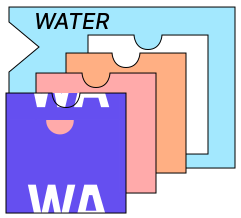

# W.A.T.E.R.: WebAssembly Transport Executables Runtime

[](https://app.fossa.com/projects/git%2Bgithub.com%2Fgaukas%2Fwater?ref=badge_shield&issueType=license)
[](https://github.com/gaukas/water/actions/workflows/go.yml)
[](https://pkg.go.dev/github.com/gaukas/water)
<!-- [](https://app.deepsource.com/gh/gaukas/water/) -->

<div style="width: 100%; height = 160px">
    <div style="width: 75%; height: 150px; float: left;"> 
        WATER-go provides a Go runtime for WebAssembly Transport Modules(WATM) as a pluggable
        application-layer transport protocol provider. It is designed to be highly portable and
        lightweight, allowing for rapidly deployable pluggable transports. While other pluggable
        transport implementations require a fresh client deployment (and app-store review) to update
        their protocol WATER allows <b><u>dynamic delivery of new transports</u></b> in real time
        over the network.<br />
        <br />
    </div>
    <div style="margin-left: 80%; height: 150px;"> 
        
    </div>
</div>

The Rust implementation of the runtime library and information about writing, buiding, and sharing WebAssembly Transport Modules(WATM) can be found in [water-rs](https://github.com/erikziyunchi/water-rs). 

## Be Water

> Empty your mind, be formless. Shapeless, like water. If you put water into a cup, it becomes the cup. You put water into a bottle and it becomes the bottle. You put it in a teapot, it becomes the teapot. Now, water can flow or it can crash. Be water, my friend.
>
> -- Bruce Lee

## Contents

This repo contains a Go package `water`, which implements the runtime library used to interact with `.wasm` WebAssembly Transport Modules(WATM). 

# Usage

<!-- ## API  -->
Based on **WASI Preview 1 (wasip1)** snapshot, currently W.A.T.E.R. provides a set of
`net`-like APIs, including `Dialer`, `Listener` and `Relay`.

### Dialer

A `Dialer` connects to a remote address and returns a `net.Conn` to the caller if the connection can
be successfully established. The `net.Conn` then provides tunnelled read and write to the remote
endpoint with the WebAssembly module wrapping / encrypting / transforming the traffic.

`Dialer` is used to encapsulate the caller's connection into an outbound, transport-wrapped
connection.

```go
	wasm, err := os.ReadFile("./examples/v0/plain/plain.wasm")

	config := &water.Config{
		TMBin:             wasm,
	}

	dialer, err := water.NewDialer(config)
	conn, err := dialer.Dial("tcp", remoteAddr)
	// ...
```

### Listener

A `Listener` listens on a local address for incoming connections which  it `Accept()`s, returning
a `net.Conn` for the caller to handle. The WebAssembly Module is responsible for the initial
accpt allowing it to implement both the server side handshake as well as any unwrap / decrypt
/reform operations required to validate and re-assemble the stream. The `net.Conn` returned provides
the normalized stream, and allows the caller to write back to the client with the WebAssembly module
encoding / encrypting / transforming traffic to be obfuscated on the wire on the way to the remote 
client.


`Listener` is used to decapsulate incoming transport-wrapped connections for the caller to handle,
managing the tunnel obfuscation once a connection is established.

```go
	wasm, err := os.ReadFile("./examples/v0/plain/plain.wasm")

	config := &water.Config{
		TMBin: wasm,
	}

	lis, err := config.Listen("tcp", localAddr)
	defer lis.Close()
	log.Infof("Listening on %s", lis.Addr().String())

	clientCntr := 0
	for {
		conn, err := lis.Accept()
		// ...
	}
```

### Relay

A `Relay` combines the role of `Dialer` and `Listener`. It listens on a local address `Accept()`-ing
incoming connections and `Dial()`-ing the remote endpoints on establishment. The connecions are
tunneled through the WebAssembly Transport Module allowing the module to handshake, encode,
transform, pad, etc. without any caller interaction. The internal `Relay` manages  the incoming
connections as well as the associated outgoing connectons.

`Relay` is a managed many-to-many handler for incoming connections that uses the WebAssemble module
to tunnel traffic.

```go
	wasm, err := os.ReadFile("./examples/v0/plain/plain.wasm")

	config := &water.Config{
		TMBin:             wasm,
	}

	relay, err := water.NewRelay(config)

	err = relay.ListenAndRelayTo("tcp", localAddr, "tcp", remoteAddr) // blocking
```

## Example

See [examples](./examples) for example usecase of W.A.T.E.R. API, including `Dialer`, `Listener` and `Relay`.